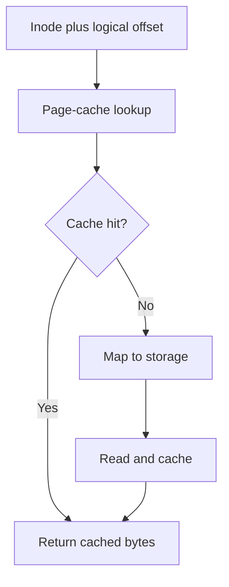

---
aliases:
  - File Blocks and Extents
  - Linux File Read Path
tags:
  - computer-system
  - operating-system
  - linux
  - filesystem
  - storage
created: 2026-07-19
summary: How a file's logical byte sequence maps to noncontiguous storage and is returned to an application in the correct order.
---
## A file is a logical byte sequence

An application sees a regular file as:

```text
byte 0, byte 1, byte 2, ... byte N
```

This is a **logical address space**. It hides the physical layout of the file on storage.

## Blocks

A local filesystem stores data in units such as blocks. A large file can occupy many blocks that are not physically adjacent:

| Logical range in file | Physical block |
|---|---:|
| bytes 0-4095 | 800 |
| bytes 4096-8191 | 203 |
| bytes 8192-12287 | 1407 |

Physical fragmentation does not change the logical order presented to the application.

## Extents

An inode does not store a separate mapping for every byte. Modern filesystems can use **extents**, which compactly map a contiguous logical range to a contiguous physical range:

```text
logical file blocks 0-99 -> physical blocks 800-899
```

If the application needs logical block 37, the filesystem can derive that it is stored in physical block 837.

## Reading a byte range

Suppose an application requests the first 4 KB of a 100 MB file.

1. Linux first resolves the pathname to the file's inode. See [[Linux Virtual File System Paths Directories and Inodes]].
2. The requested byte range determines the logical file block or cached page.
3. Linux checks the page cache.
4. On a cache miss, the filesystem translates the logical range into physical storage locations.
5. It reads missing data and returns the requested bytes in logical order.



Linux does not need to read the other 99.996 MB merely because they belong to the same file.

## Reassembling scattered storage

If a request spans several noncontiguous blocks, Linux uses their logical positions to place them into the application buffer in order:

```text
physical block 800  -> buffer bytes 0-4095
physical block 203  -> buffer bytes 4096-8191
physical block 1407 -> buffer bytes 8192-12287
```

The kernel is not guessing how the pieces fit together. Filesystem metadata explicitly records the logical-to-physical mapping.

## Read ahead

Linux may predict a sequential access pattern and fetch more than the application immediately requested. The extra data remains cached for likely future reads:

```text
Application requests: 4 KB
Kernel may fetch:      a larger nearby range
Application receives: only the requested 4 KB now
```

Readahead changes performance, not the file abstraction.

## Blocks are not GFS chunks

These concepts exist at different layers:

```text
GFS file
    -> 64 MB GFS chunks
    -> ordinary Linux files on chunkservers
    -> Linux filesystem blocks or extents
    -> local storage
```

See [[Google File System]] for why GFS chose chunks far larger than ordinary local-filesystem blocks.

## Related notes

- [[Linux Filesystem MOC]]
- [[Linux Virtual File System Paths Directories and Inodes]]
- [[Linux Page Cache Writeback and Journaling]]
- [[Google File System]]

[^write]: Linux manual pages, [`write(2)`](https://man7.org/linux/man-pages/man2/write.2.html).