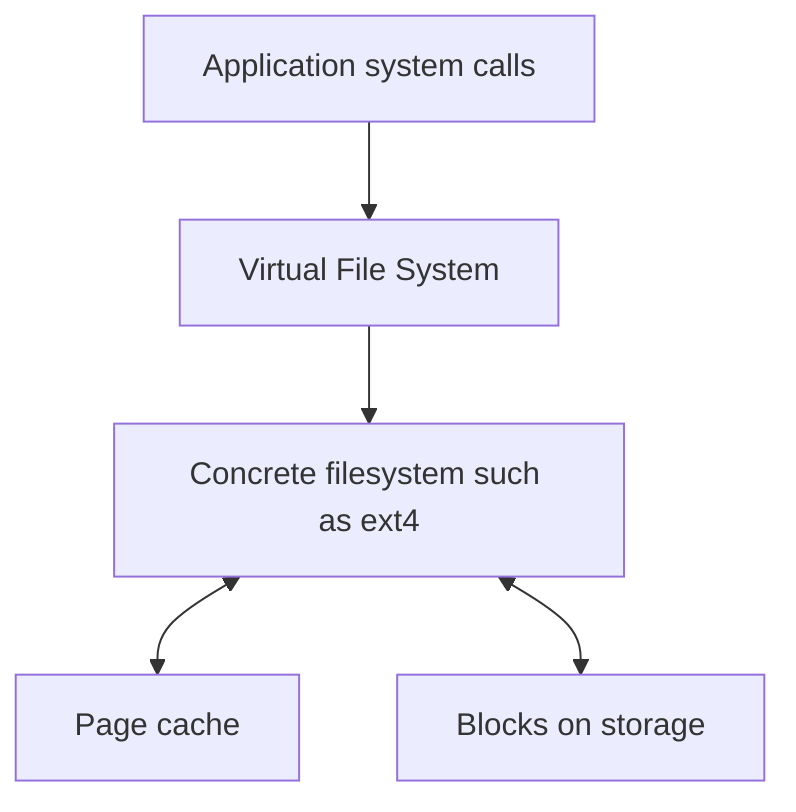

---
aliases:
  - Filesystem Map of Content
tags:
  - cost-optimization
  - operating-system
  - filesystem
  - moc
created: 2026-07-19
summary: Map of content for Linux filesystem abstractions, data layout, caching, persistence, and write semantics.
title: Linux Filesystem MOC
---
## Mental model

An application sees a file as a named, ordered sequence of bytes. Linux builds that abstraction from several layers:

The pathname identifies **which filesystem object** the application means. The file offset identifies **which bytes within that object** it wants.

## Notes

- [[Linux Virtual File System Paths Directories and Inodes]]
  - VFS versus concrete filesystems
  - pathname traversal
  - directories, directory entries, and inodes
- [[Linux File Blocks Extents and Reads]]
  - logical byte offsets
  - physical blocks and extents
  - cache lookup and ordered reads
- [[Linux Page Cache Writeback and Journaling]]
  - clean and dirty cached pages
  - background writeback and `fsync()`
  - why journaling is not the same as writeback
- [[Filesystem Write Guarantees]]
  - atomicity, durability, consistency, and ordering
  - concurrent append and check-then-act races

## Bridge to distributed systems

Local filesystems already coordinate names, metadata, storage allocation, caching, and crash recovery. A distributed filesystem adds partial failure, network uncertainty, replication, concurrent clients, and machines that may disagree.

The next learning path is [[Google File System]]. Its focused notes are:

- [[GFS Architecture Chunks and Metadata]]
- [[GFS Read Path and Master Scalability]]
- [[GFS Mutation Protocol and Leases]]
- [[GFS Record Append and Consistency]]
- [[GFS Failure Recovery Replica Placement and Checksums]]
- [[GFS Snapshots Garbage Collection and Workloads]]

| Local-filesystem idea | GFS analogue |
|---|---|
| Pathname and inode metadata | Master namespace and file-to-chunk mapping |
| Filesystem block or extent | 64 MB GFS chunk |
| Local block storage | Replicated chunkservers |
| Atomic append coordination | GFS record append |
| Local crash recovery | Replica repair, versioning, and master recovery |

## Key question

> What guarantee does the interface promise when an operation reports success?

This question separates a mere implementation detail from an actual atomicity, durability, or consistency failure.