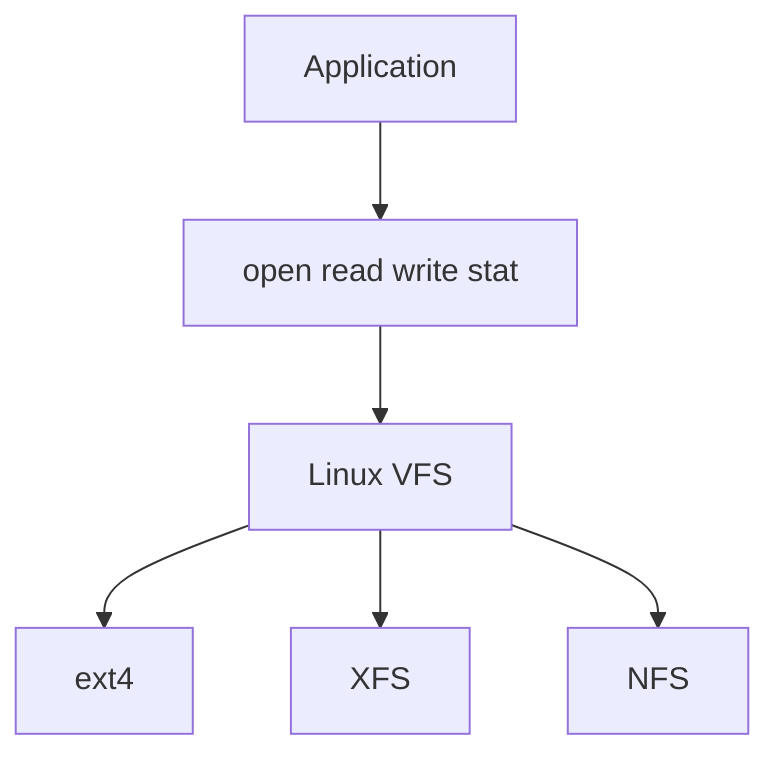

---
aliases:
  - Linux VFS
  - Path Resolution and Inodes
  - Directory Entries and Inodes
tags:
  - computer-system
  - operating-system
  - linux
  - filesystem
  - vfs
  - inode
created: 2026-07-19
summary: How Linux resolves a pathname through directories to an inode and exposes different filesystem implementations through the VFS layer.
---
## VFS is an interface layer

Linux supports concrete filesystem implementations such as ext4, XFS, Btrfs, tmpfs, and NFS. The **Virtual File System (VFS)** is the kernel layer that gives applications a common interface to them.[^vfs]



The VFS is not the same thing as the directory hierarchy. The hierarchy is the **filesystem namespace**; VFS is the abstraction and dispatch layer through which Linux operates on that namespace.

## A pathname is not a physical disk address

The pathname:

```text
/notes/systems/gfs.md
```

does not say where the bytes physically reside. It gives Linux a sequence of names to resolve:

```text
/ -> notes -> systems -> gfs.md
```

Linux traverses the path one component at a time, normally using cached lookup objects when possible.

## Directory and directory entry

A directory is a filesystem object whose persistent data associates child names with filesystem objects. In a simplified on-disk model:

```text
directory inode 80
├── "systems" -> inode 120
├── "networking.md" -> inode 2052
└── "docker.md" -> inode 2053
```

Linux VFS also uses an in-memory object called a **dentry** and a **dentry cache**. A dentry associates a pathname component with an inode for fast lookup; VFS dentries themselves are cached in RAM rather than being the filesystem's persistent directory representation.[^vfs]

This distinction prevents an oversimplification:

- persistent directory data records names according to the concrete filesystem's format;
- the VFS dentry is Linux's in-memory lookup object for a name.

## Inode

An **inode** represents a filesystem object, including a regular file, directory, symbolic link, FIFO, or other supported type.[^vfs]

A simplified regular-file inode contains:

```text
inode 2051
├── type: regular file
├── owner and permissions
├── size and timestamps
└── mapping from logical file ranges to storage
```

The filename normally belongs to the directory entry, not to the inode:

```text
"gfs.md" -> inode 2051
```

Therefore, multiple hard links can give different names to the same regular-file inode.

## Directories have inodes too

Inodes are not only leaf nodes. Both files and subdirectories have inodes:

```text
root inode 2
└── "notes" -> directory inode 80
    └── "systems" -> directory inode 120
        └── "gfs.md" -> regular-file inode 2051
```

The namespace appears tree-shaped because each directory contains mappings to its children. Hard links mean the complete namespace is not always a strict tree, although Linux restricts hard links to directories to avoid cycles.

## Path resolution example

To resolve `/notes/systems/gfs.md`, Linux conceptually:

1. Starts from the root directory inode.
2. Looks up `notes` and follows its inode.
3. Confirms that inode represents a directory.
4. Looks up `systems` within it and follows that inode.
5. Looks up `gfs.md` within `systems`.
6. Reaches the final inode representing the regular file.

Reaching the inode identifies the file; it does not require reading the entire file. The requested byte offset is handled separately by [[Linux File Blocks Extents and Reads]].

## Retrieval chain

```text
pathname
    -> directory-component traversal
    -> final dentry/inode
    -> logical file offset
    -> cached page or storage mapping
    -> bytes returned to application
```

## Common misconceptions

- **The path is the disk location.** No; it is a name in the namespace.
- **Only ordinary files have inodes.** No; directories and other filesystem objects do too.
- **The inode stores the filename.** Normally the parent directory associates the name with the inode.
- **A dentry is simply the permanent on-disk directory entry.** In Linux VFS terminology, a dentry is specifically an in-memory lookup/cache object.

## Related notes

- [[Linux Filesystem MOC]]
- [[Linux File Blocks Extents and Reads]]
- [[Linux Page Cache Writeback and Journaling]]
- [[Filesystem Write Guarantees]]
- [[Google File System]]

[^vfs]: Linux Kernel documentation, [Overview of the Linux Virtual File System](https://www.kernel.org/doc/html/latest/filesystems/vfs.html).