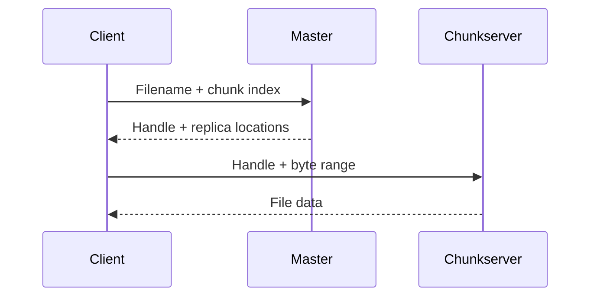

---
aliases:
  - GFS Reads
  - Why the GFS Master Is Not a Data Bottleneck
tags:
  - computer-system
  - distributed-systems
  - filesystem
  - gfs
  - prompt-caching
  - scalability
summary: How GFS reads bypass the master after metadata lookup and why 64 MB chunks improve scalability while creating hotspot risks.
date: 2026-07-21
---

## Read path

Suppose an application reads a byte range from file `F`.

1. The client computes the logical chunk index from the file offset and the 64 MB chunk size.
2. It asks the master for `(filename, chunk index)`.
3. The master returns the chunk handle and replica locations.
4. The client caches that mapping for a limited time.
5. The client chooses a replica, often a nearby one, and requests `(chunk handle, internal byte range)` directly from that chunkserver.



Reads do not require a primary or lease. Those concepts exist to order mutations.

## Why the master is usually not a bottleneck

The master handles metadata, not bulk file data. Client caching further amortizes master work:

```text
(F, chunk 2) -> H93 -> [S1, S4, S7]
```

Further operations on the same chunk need no new master lookup until the cache expires or the file is reopened. A client can request several chunk mappings at once, and the master can include information about immediately following chunks.

Large sequential reads are therefore favorable: one metadata lookup can support up to 64 MB of direct data transfer, followed by prefetched metadata for later chunks.

## Why 64 MB chunks help

Large chunks provide three important benefits:

- fewer file-to-chunk mappings in master memory;
- fewer master lookups during sequential I/O;
- longer-lived client–chunkserver connections for repeated operations on one chunk.

Chunkservers allocate their local Linux files lazily, so a short final chunk does not need to occupy a full 64 MB physically.

## The hotspot trade-off

A small file may occupy only one chunk:

```text
Thousands of readers
        -> H1
        -> only S1, S2, and S3
```

Reads can spread among replicas, but the small replica set may still become overloaded. A higher replication factor and staggered access can reduce a read hotspot.

For writes, the hotspot is stronger because all mutations to a chunk must be ordered by its current primary. Extra read replicas do not eliminate that single-primary ordering point. See [[GFS Mutation Protocol and Leases]].

## When the master can become a bottleneck

The design works best when metadata cost is amortized across large files and chunks. Pressure rises with:

- millions of tiny files;
- frequent create, delete, rename, and namespace scans;
- access patterns that defeat metadata caching;
- many independent chunks requiring separate control decisions.

The key distinction is:

> Large sequential reads stress chunkserver and network throughput; tiny-file and namespace-heavy workloads stress master metadata capacity.

## Related notes

- [[Google File System]]
- [[GFS Architecture Chunks and Metadata]]
- [[GFS Snapshots Garbage Collection and Workloads]]
- [[Linux File Blocks Extents and Reads]]

[^gfs]: Ghemawat, Gobioff, and Leung, [“The Google File System”](https://research.google.com/archive/gfs-sosp2003.pdf), §§2.4–2.6.
