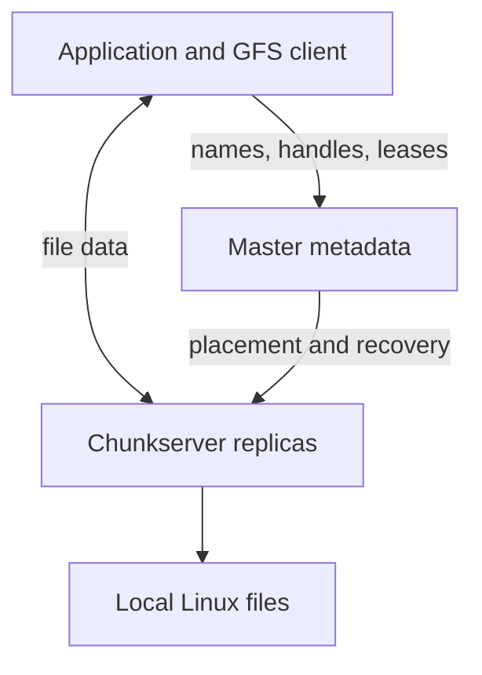

---
tags:
  - compiler
  - operating-system
  - distributed-systems
  - filesystem
  - gfs
  - moc
created: 2026-07-21
aliases:
  - GFS
  - Google File System MOC
title: Google File System
summary: Map of content for GFS architecture, I/O protocols, consistency, recovery, snapshots, and workload trade-offs.
---
GFS is a distributed filesystem designed around a specific workload: very large files, frequent component failures, high-throughput sequential access, and many concurrent appenders. Its design becomes easier to understand once every mechanism is connected to those assumptions.[^gfs]

## Core mental model

The master coordinates metadata but normally stays outside the data path. Clients obtain chunk metadata from the master, cache it briefly, and transfer bytes directly to or from chunkservers.

## Notes

- [[GFS Architecture Chunks and Metadata]]
  - master, clients, and chunkservers
  - 64 MB chunks and immutable handles
  - in-memory metadata, operation log, and checkpoints
- [[GFS Read Path and Master Scalability]]
  - filename and offset to chunk lookup
  - direct client–chunkserver reads
  - metadata caching, large-chunk benefits, and hotspots
- [[GFS Mutation Protocol and Leases]]
  - primary and secondary replicas
  - separating data flow from mutation ordering
  - lease expiration, failures, and ambiguous outcomes
- [[GFS Record Append and Consistency]]
  - GFS-selected append offsets
  - 16 MB record limit, padding, and retries
  - consistent, defined, and inconsistent regions
- [[GFS Failure Recovery Replica Placement and Checksums]]
  - version numbers and stale replicas
  - re-replication priorities and rack-aware placement
  - local checksums versus legal replica divergence
- [[GFS Snapshots Garbage Collection and Workloads]]
  - copy-on-write snapshots
  - lazy deletion and orphan cleanup
  - workloads that fit and do not fit GFS

## One-sentence architecture answer

> GFS centralizes namespace and replica-management decisions in one master, stores large file chunks on replicated chunkservers, and keeps bulk data traffic off the master by letting clients communicate directly with replicas.

## Connections to local filesystems

| Local filesystem concept | GFS concept |
|---|---|
| Path and inode metadata | Master namespace and file-to-chunk mapping |
| Block or extent | 64 MB chunk |
| Local storage device | Replicated chunkservers |
| `O_APPEND` coordinates a local end offset | Record append coordinates an offset across replicas |
| Journaling and recovery | Master operation log, checkpoints, and replica recovery |
| Local corruption check | Per-chunkserver block checksums |

Start from [[Linux Filesystem MOC]] and [[Filesystem Write Guarantees]] when comparing GFS with a local filesystem.

[^gfs]: Ghemawat, Gobioff, and Leung, [“The Google File System”](https://research.google.com/archive/gfs-sosp2003.pdf), SOSP 2003.
